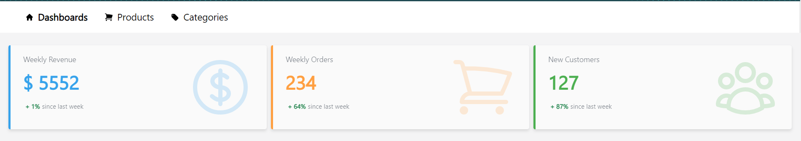
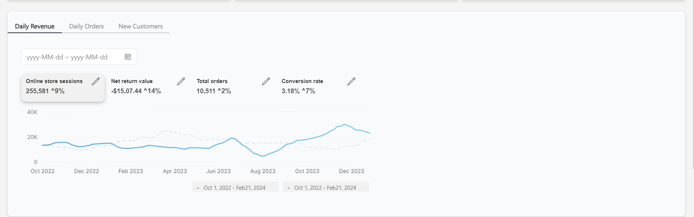
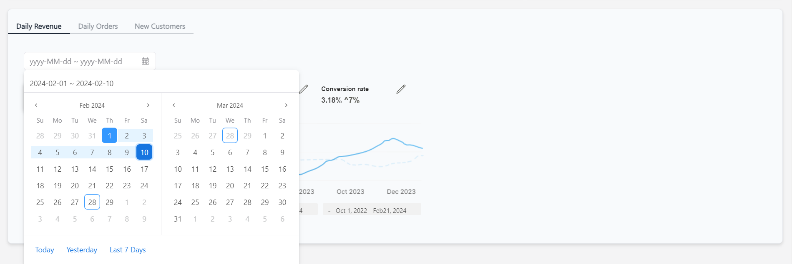

## Quick Start

Run the following command to download the node_modules:

```
npm install
```

Once the setup is complete, navigate to the project folder and start your project with:

```
npm run dev
```

Your application will be accessible at http://localhost:5173








